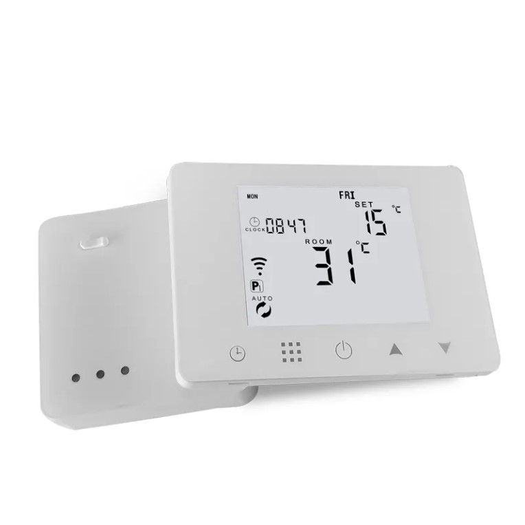
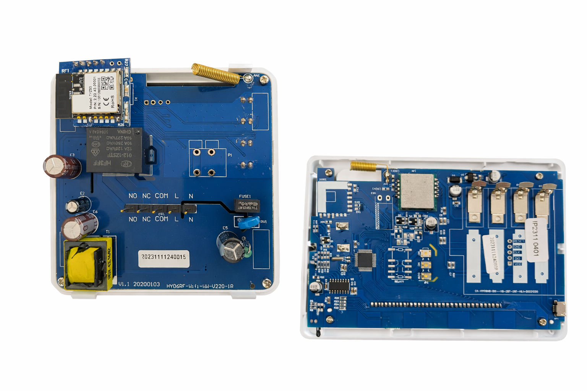

# Tuya HY09 Boiler Thermostat – Zigbee2MQTT External Converter

This repository provides an **external Zigbee2MQTT converter** for No-Brand **HY09 boiler thermostat**.

The device **reports itself as `TS0601` with manufacturer `_TZE200_znzs7yaw`**, but this Zigbee identification is **wrong** and does **not reflect the actual datapoint layout** of this device.
As a result, default Zigbee2MQTT converters expose incorrect or incomplete functionality.

This converter intentionally **overrides the reported Zigbee identity** and implements the **correct datapoint mapping for the HY09 thermostat**, based on real device behavior.




## Installation

Copy the converter file into your Zigbee2MQTT data directory, for example: `zigbee2mqtt/external_converters/tuya_hy09_thermostat.js` and then restart Zigbee2MQTT.

## Exposed features

### Climate control
- System mode: `off`, `heat`
- Target (setpoint) temperature  
  - Range: `5–35 °C`
  - Step: `0.5 °C`
  - The thermostat additionally enforces its own `min_temperature` / `max_temperature` limits
- Current room temperature
- Room temperature calibration: `-9` to `+9 °C`
- Heating running state:
  - `idle`
  - `heat`
- Preset modes:
  - `manual`
  - `auto`
  - `mixed`
  - `holiday`

  The thermostat ignores a remote switch back to `auto`, use the buttons on the device for that.

---

### Scheduling

The thermostat supports weekly scheduling with multiple layout types.

#### Schedule types
- `5+2`
- `6+1`
- `7`

#### Schedule blocks
Each schedule block requires **exactly three periods**:
- Workdays AM
- Workdays PM
- Weekend AM
- Weekend PM

#### Schedule format
Each period must be written in the following format:

```hh:mm/cc.c°C```

Multiple periods are separated by spaces. Hours are `0–23`, minutes `0–59` and the temperature `5–35 °C` in **whole degrees**. Invalid schedules are rejected with an error message instead of being sent to the device.

**Example (valid schedule block):**

```06:00/21.0°C 12:00/18.0°C 18:00/22.0°C```

> The thermostat only reports a schedule when it is edited on the device, so the schedule values in Zigbee2MQTT can be stale until then.

---

### Holiday mode
- Holiday duration:
  - Range: `0–365` days
- Holiday target temperature

### Additional configuration
- Child lock
- Power-on behavior (`previous`, `off`, `on`; only `previous` has been verified, the manual only lists "with memory" and "without memory")
- Hysteresis (`temperature_return_difference`): `0.5–2.5 °C`, step `0.5`
- High temperature protection (enable/disable)
- Low temperature protection (enable/disable)
- High temperature limit
- Low temperature limit
- Protection hysteresis / deadzone configuration
- Minimum temperature limit (`1–10 °C`) and maximum temperature limit (`20–90 °C`)

### Read only
- Sensor mode (`IN`, `OU`, `AL`), only reported when it changes on the device
- External sensor temperature (`0` when no sensor is connected)
- High temperature alarm
- Error status reporting (raw value)
